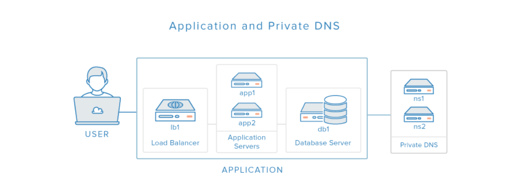

# Práctica 8: Implantación de Wordpress en Amazon Web Services (AWS) sobre la pila LAMP

La arquitectura se forma por:
  - Un balanceador de carga , implementado con un Apache HTTP Server configurado como proxy inverso
  - Una capa de front-end , formada por dos servidores web con Apache HTTP Server
  - Una capa de back-end, formada por un servidor MySQL
 
Se necesitará las siguientes máquinas:
  - Balanceador
  - Front-end 1
  - Front-end 2
  - Servidor de Base de Datos MySQL

